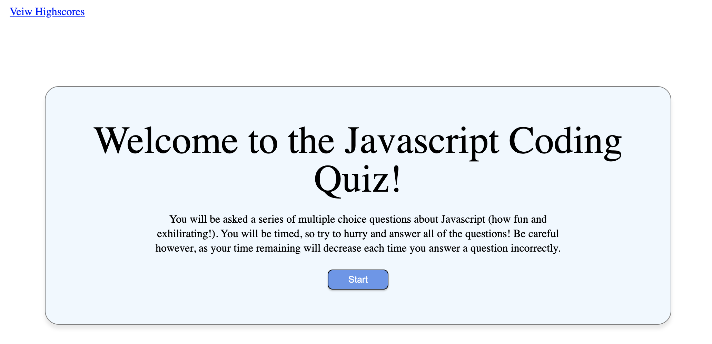
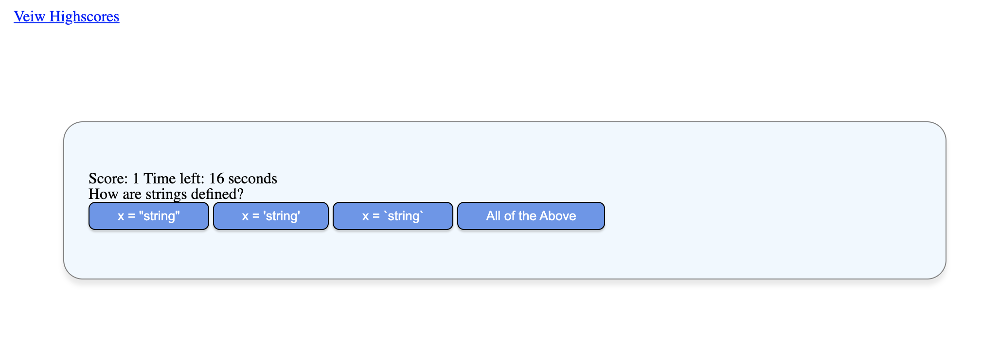
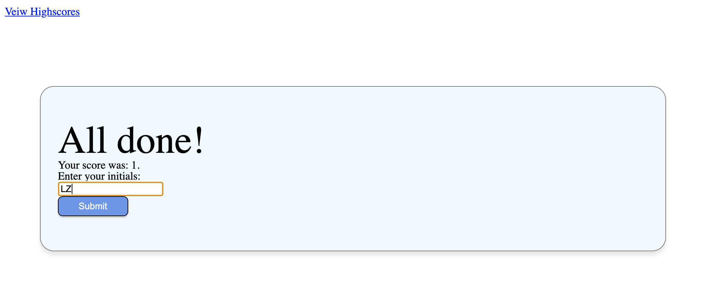
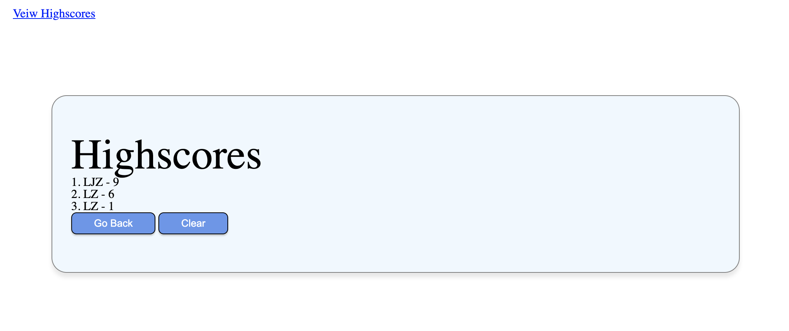

# JavaScript Coding Quiz

## Table of Contents (Optional)
* [Description](#Description)
* [Instructions](#Instructions)
* [Questions](#Questions)
* [License](#License)

---

## Description

Welcome to the JavaScript Coding Quiz! In this application, you will be asked a series of multiple-choice, JavaScript related questions. You'll be timed when you start the quiz so make sure to answer each question as quickly as you can. Be careful however, as time will be deducted if you answer a question incorrectly. At the end of the quiz, you'll have a chance to save your score and initials. Because the scores & initials are saved on local storage, you can leave the website and come back without losing your highscores.

---

## Instructions

1. Open up the github repo website here: [Javascript Coding Quiz](https://zehrl.github.io/javascript-coding-quiz/)
2. Click "start" to begin

3. Answer each question by clicking on 1 of the 4 options listed below

4. Once you answer all questions or the time runs out, you'll be sent to the highscore entry page

5. You'll then be sent to the highscore page which will display the top 3 highscores and initials

Have fun!

---

## Questions

* My github: https://github.com/zehrl
* Email me at zehrl315@outlook.com if you have any questions.

---

## License

Copyright 2020 Logan J. Zehr

Permission is hereby granted, free of charge, to any person obtaining a copy of this software and associated documentation files (the "Software"), to deal in the Software without restriction, including without limitation the rights to use, copy, modify, merge, publish, distribute, sublicense, and/or sell copies of the Software, and to permit persons to whom the Software is furnished to do so, subject to the following conditions:

The above copyright notice and this permission notice shall be included in all copies or substantial portions of the Software.

THE SOFTWARE IS PROVIDED "AS IS", WITHOUT WARRANTY OF ANY KIND, EXPRESS OR IMPLIED, INCLUDING BUT NOT LIMITED TO THE WARRANTIES OF MERCHANTABILITY, FITNESS FOR A PARTICULAR PURPOSE AND NONINFRINGEMENT. IN NO EVENT SHALL THE AUTHORS OR COPYRIGHT HOLDERS BE LIABLE FOR ANY CLAIM, DAMAGES OR OTHER LIABILITY, WHETHER IN AN ACTION OF CONTRACT, TORT OR OTHERWISE, ARISING FROM, OUT OF OR IN CONNECTION WITH THE SOFTWARE OR THE USE OR OTHER DEALINGS IN THE SOFTWARE.